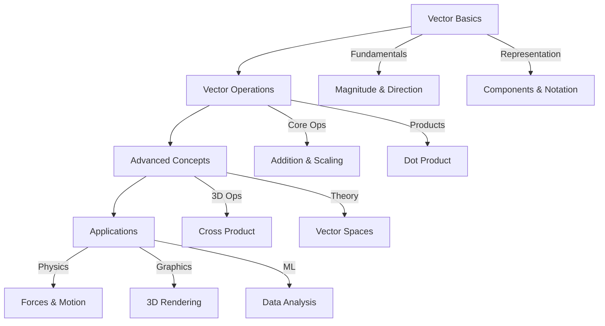

# Vectors and Operations

Think of vectors as arrows in space that point somewhere with purpose! They're like GPS directions that tell you both how far to go AND which direction to head. In programming, they're arrays with mathematical superpowers.

## Overview

Vectors are fundamental mathematical objects that represent quantities with both magnitude (size) and direction. They're essential for understanding physics, computer graphics, machine learning, and game development. From modeling velocity and force to representing data points in high-dimensional spaces, vectors are the building blocks of linear algebra.

## Section Contents

### [Vector Basics](basics.md)
**Foundation concepts and representations**
- Understanding magnitude and direction
- Vector notation and components
- Basic vector arithmetic
- Programming implementations
- Interactive exploration tools

*Start here if you're new to vectors or need a refresher on fundamental concepts.*

### [Vector Operations](operations.md)
**Core mathematical operations and their properties**
- Addition and subtraction
- Scalar multiplication
- Dot product theory and applications
- Vector projections and angles
- Computational efficiency techniques

*Essential operations that form the backbone of vector mathematics.*

### [Advanced Vector Concepts](advanced.md)
**3D operations and specialized techniques**
- Cross product and geometric interpretation
- Common vector patterns and transformations
- Optimization techniques
- Unit vectors and normalization
- Vector spaces and linear independence

*Advanced topics for deeper mathematical understanding.*

### [Real-World Applications](applications.md)
**Physics, engineering, and computer science applications**
- Physics simulations and mechanics
- Computer graphics and 3D rendering
- Machine learning and data science
- Game development and collision detection
- Engineering and robotics

*See vectors in action across diverse practical domains.*

## Learning Path

## Prerequisites

Before diving into vectors, ensure you're comfortable with:
- [Variables and Expressions](../../basics/variables-expressions.md)
- [Basic Arithmetic Operations](../../basics/order-of-operations.md)
- Coordinate systems and graphing

## What You'll Master

By completing this section, you'll be able to:

✅ **Represent and visualize vectors** in 2D and 3D space  
✅ **Perform vector arithmetic** (addition, subtraction, scaling)  
✅ **Calculate dot and cross products** and understand their geometric meaning  
✅ **Apply vectors to solve problems** in physics, graphics, and data science  
✅ **Implement efficient vector operations** in code  
✅ **Understand geometric relationships** through vector analysis  

## Key Mathematical Relationships

$$
\begin{align}
\text{Vector Addition: } \vec{u} + \vec{v} &= (u_1 + v_1, u_2 + v_2, u_3 + v_3) \\
\text{Scalar Multiplication: } c\vec{u} &= (cu_1, cu_2, cu_3) \\
\text{Dot Product: } \vec{u} \cdot \vec{v} &= u_1v_1 + u_2v_2 + u_3v_3 \\
\text{Magnitude: } |\vec{u}| &= \sqrt{u_1^2 + u_2^2 + u_3^2} \\
\text{Cross Product: } \vec{u} \times \vec{v} &= (u_2v_3 - u_3v_2, u_3v_1 - u_1v_3, u_1v_2 - u_2v_1)
\end{align}
$$

## Quick Reference

| Operation | Notation | Result | Use Case |
|-----------|----------|--------|----------|
| Addition | $\vec{u} + \vec{v}$ | Vector | Combining velocities |
| Scalar Mult | $c\vec{u}$ | Vector | Scaling magnitude |
| Dot Product | $\vec{u} \cdot \vec{v}$ | Scalar | Measuring similarity |
| Cross Product | $\vec{u} \times \vec{v}$ | Vector | Finding perpendicular |
| Magnitude | $\|\vec{u}\|$ | Scalar | Measuring length |

## Navigation

- [Start with Vector Basics →](basics.md)
- [Linear Algebra Overview](../index.md)
- [Next: Matrices](../matrices/index.md)
